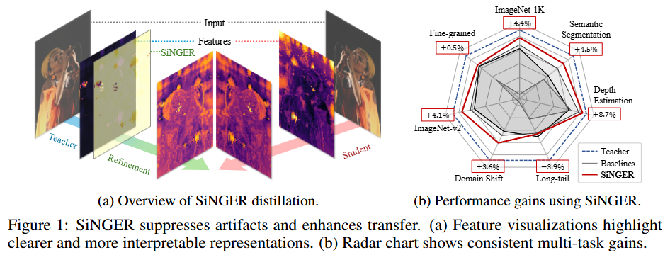
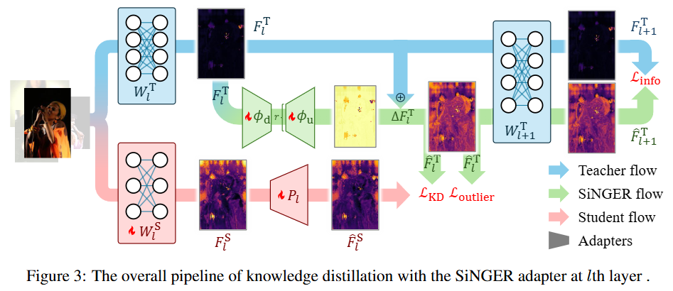
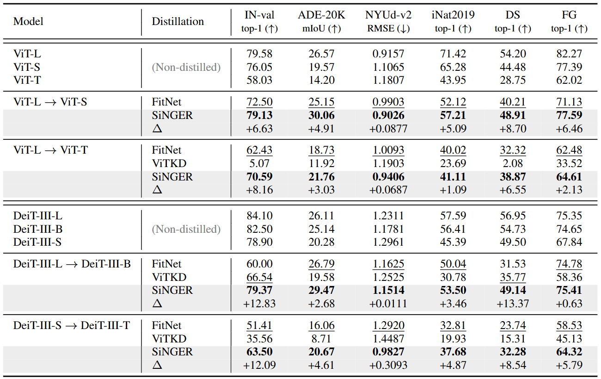
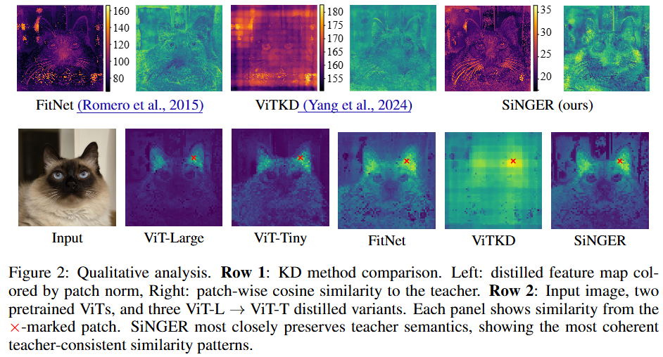

# SiNGER: A Clearer Voice Distills Vision Transformers Further

The official implementation of "[SiNGER: A Clearer Voice Distills Vision Transformers Further](https://arxiv.org/abs/2509.20986)" (arXiv:2509.20986).

## Summary

### Abstract

> Vision Transformers are widely adopted as the backbone of vision foundation models, but they are known to produce high-norm artifacts that degrade representation quality. When knowledge distillation transfers these features to students, high-norm artifacts dominate the objective, so students overfit to artifacts and underweight informative signals, diminishing the gains from larger models. Prior work attempted to remove artifacts but encountered an inherent trade-off between artifact suppression and preserving informative signals from teachers. To address this, we introduce Singular Nullspace-Guided Energy Reallocation (SiNGER), a novel distillation framework that suppresses artifacts while preserving informative signals. The key idea is principled teacher feature refinement: during refinement, we leverage the nullspace-guided perturbation to preserve information while suppressing artifacts. Then, the refined teacher's features are distilled to a student. We implement this perturbation efficiently with a LoRA-based adapter that requires minimal structural modification. Extensive experiments show that \oursname consistently improves student models, achieving state-of-the-art performance in multiple downstream tasks and producing clearer and more interpretable representations.

### Figures




### Main Result




## Installation

Environments:

- Python 3.11.11
- PyTorch 2.6.0
- torchvision 0.21.0

Install the package:

```
conda env create -f environment.yaml
conda activate singer
python3 setup.py develop
```

## Getting started

0. Wandb as the logger

- The registeration: <https://wandb.ai/home>.
- If you don't want wandb as your logger, set `CFG.LOG.WANDB` as `False` at `mdistiller/engine/cfg.py`.

1. DDP setup

    ```bash
    # for instance, FitNet method.
    # get the number of active devices and set the number of OpenMP threads.
    export CUDA_DEVICE_COUNT=$(python -c "import torch; print(torch.cuda.device_count())")
    export OMP_NUM_THREADS=4
    ```

2. Training on ImageNet

- Download the dataset at <https://image-net.org/> and put them to `./data/imagenet`

  ```bash
  torchrun --nproc-per-node=$CUDA_DEVICE_COUNT tools/train.py --cfg configs/imagenet/vit/singer.yaml ./configs/imagenet/optim/adamw.yaml
  ```

- Config examples for experiment are in `configs/imagenet/vit`. If you want to custom config, modify  `mdistiller/engines/cfg.py` and `mdisitller/disitllers/....py`

  ```yaml
  SiNGER:
    M_LAYERS: [17]  # for distillation layer selection.
    RANK: 64
    OUTLIER_Q: 0.97
    METHOD: 'singer'
    INPUT_SIZE: [224, 224] 
    LOSS:
      FEAT_WEIGHT: 1.0
  ```


3. Evaluation

- You can evaluate the performance of our models or models trained by yourself.

  ```bash
  # evaluate students 
  # ImageNet-1K classification
  export SET_DC="--nproc-per-node=$CUDA_DEVICE_COUNT"
  export ARGS="--epochs 150 --batch-size 64 --test-batch-size 64 -lr 0.5"
  export SAVE_DIR="vit-baselines/singer,vit-large,vit-tiny,layer17"
  torchrun $SET_DC tools/lineval/imagenet.py $SAVE_DIR $ARGS 
  python tools/lineval/test/imagenet.py $SAVE_DIR

  # NYUd Depth estimation
  export SET_DC="--nproc-per-node=$CUDA_DEVICE_COUNT"
  export ARGS="--epochs 200 --batch-size 64 --test-batch-size 64 -lr 0.5"
  export SAVE_DIR="vit-baselines/singer,vit-large,vit-tiny,layer17"
  torchrun $SET_DC tools/lineval/nyud.py $SAVE_DIR $ARGS 
  python tools/lineval/test/nyud.py $SAVE_DIR -t 0.6

  # ADE-20K Semantic segmentation
  export SET_DC="--nproc-per-node=$CUDA_DEVICE_COUNT"
  export ARGS="--epochs 200 --batch-size 64 --test-batch-size 64 -lr 0.5"
  export SAVE_DIR="vit-baselines/singer,vit-large,vit-tiny,layer17"
  torchrun $SET_DC tools/lineval/ade20k.py $SAVE_DIR $ARGS
  python tools/lineval/test/ade20k.py $SAVE_DIR
  ```
- For ImageNet-R and ImageNet-v2, you can reuse the ImageNet-1K classification head.

## Citation

You can cite our work by BiBTex.

```bibtex
@article{yu2025singer,
  title={SiNGER: A Clearer Voice Distills Vision Transformers Further},
  author={Yu, Geunhyeok and Jeong, Sunjae and Choi, Yoonyoung and Kim, Jaeseung and Hwang, Hyoseok},
  journal={arXiv preprint arXiv:2509.20986},
  year={2025}
}
```

## License

This project is released under the MIT License (see LICENSE).

This codebase includes components from:
- mdistiller (see licenses/LICENSE_mdistiller)
- detectron2 (see licenses/LICENSE_detectron2)
- RepDistiller (see licenses/LICENSE_RepDistiller)
